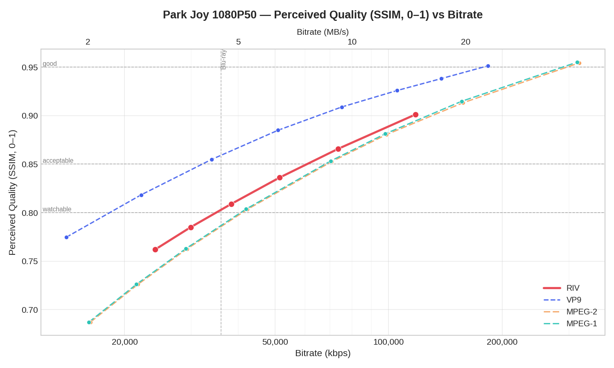

# RIV — ReItero Video

[](#license)
[](https://www.rust-lang.org)
[](https://webassembly.org)

**[Live WASM demo — Big Buck Bunny encoded with RIV](https://coffeecupentertainment.com/static/riv2-player/index.html?bbb.riv)**

A pure-Rust, WASM-compatible video codec. No C FFI. No native dependencies. Just `cargo add`.

Built for embedding pre-rendered video (cutscenes, trailers, demos) in Rust/WASM applications — originally developed for the [Repang](https://coffeecupentertainment.com/articles/repang) game engine.

---

## Talk is cheap, show me the graphs



---

## Why

Shipping video in a WASM game binary is awkward:

- `libvpx` / `openh264` — C FFI, messy WASM C stdlib story
- Browser `VideoDecoder` API — browser-only, requires JS glue, no native fallback
- Raw H.264 in Rust — patent-encumbered, no pure-Rust encoder

RIV is a self-contained codec in pure Rust with a single code path for native and WASM. It is not trying to beat H.264 on compression. It is trying to be **the simplest correct answer** when you need video in a Rust/WASM context.

> *"How hard could it be?" — the answer was very hard, but here we are.*

---

## Features

- **Pure Rust** — no C, no bindgen, no system libraries required
- **WASM-safe** — compiles to `wasm32-unknown-unknown` out of the box
- **I + P frame codec** — intra and inter frames with motion-compensated prediction
- **Fast encoding** — ~80 fps on 352×288, 4–7× faster than VP9 at comparable quality
- **RANS entropy coding** — RANS32 with VP8-style adaptive contexts for MVs and residuals
- **DCT residual coding** — 16×16 luma / 8×8 chroma; JPEG-style intra, adaptive-Q inter
- **Sub-pixel motion** — ½-pixel bilinear interpolation; hex + diamond search
- **7-mode MV predictor tree** — Nearest, Near, TopRight, TopLeft, Temporal, Zero, New
- **RDO skip decisions** — lambda-weighted cost model per block
- **Formally specified** — full normative bitstream spec in [`SPEC.md`](reitero_video/SPEC.md)
- **MIT / Unlicense** — do whatever you want with it

---

## Quick Start

### Library

```toml
[dependencies]
reitero_encode = { git = "ssh://git@github.com/xhighway999/riv2.git", package = "reitero_encode" }
reitero_decode = { git = "ssh://git@github.com/xhighway999/riv2.git", package = "reitero_decode" }
```

**Encode:**

```rust
use reitero_encode::{Encoder, EncoderConfig, Frame, VecWriter};

let config = EncoderConfig::new(1920, 1080, 30); // width, height, fps
let mut encoder = Encoder::new(config, VecWriter::new())?;

for (i, rgb_frame) in source_frames.iter().enumerate() {
    let timestamp_ms = (i as u64 * 1000) / 30;
    encoder.encode_frame(Frame::new(rgb_frame, 1920, 1080, timestamp_ms))?;
}

let riv_bytes: Vec<u8> = encoder.finish()?;
```

**Decode:**

```rust
use reitero_decode::Decoder;

let mut decoder = Decoder::new(my_reader)?;

while decoder.has_more_frames() {
    let frame = decoder.decode_frame()?;
    // frame.data: Vec<u8> — RGB24, row-major, cropped to display size
    // frame.width, frame.height, frame.timestamp_ms
    render(&frame.data, frame.width, frame.height);
}
```

### CLI

Requires FFmpeg on `$PATH` for container I/O.

```sh
cargo build --release -p reitero_video_tools

# Encode from any format FFmpeg can read
ri-cli encode input.mp4 output.riv --quality 85 --quality-uv 80

# Decode back to a container
ri-cli decode output.riv out.mp4

# Roundtrip sanity check
ri-cli roundtrip input.mp4
```

---

## Benchmarks

All benchmarks on native release build (`full-opt` profile, `target-cpu=native`). Quality and
bitrate from `bench/run.py`; encode/decode speed from `bench/speedbench.py` at matched quality
points (~30 dB PSNR on CIF, ~27 dB on 1080p). Decode speed is pure decode to `/dev/null` —
no I/O or PSNR scoring overhead.

### Foreman CIF — 352×288 @ 30 fps, 300 frames

#### Quality vs bitrate

| Codec   | Quality | Bitrate   | PSNR  | SSIM  |
|---------|---------|-----------|-------|-------|
| **RIV** | 95/90   | 1559 kbps | 33.95 | 0.923 |
| **RIV** | 90/85   | 952 kbps  | 32.04 | 0.894 |
| **RIV** | 85/80   | 665 kbps  | 30.74 | 0.869 |
| **RIV** | 80/75   | 504 kbps  | 29.79 | 0.848 |
| **RIV** | 75/70   | 403 kbps  | 29.00 | 0.829 |
| VP9     | q=30    | 630 kbps  | 35.56 | 0.946 |
| VP9     | q=35    | 404 kbps  | 34.24 | 0.931 |
| VP9     | q=40    | 267 kbps  | 32.93 | 0.911 |
| VP9     | q=45    | 179 kbps  | 31.58 | 0.886 |
| MPEG-1  | q=8     | 944 kbps  | 31.89 | 0.883 |
| MPEG-2  | q=12    | 596 kbps  | 30.06 | 0.844 |

#### Speed at matched quality (~30 dB PSNR)

| Codec      | Encode fps | Decode fps |
|------------|------------|------------|
| **RIV** (85/80) | **79**  | **470**    |
| VP9 (crf=50)    | 31      | 1350       |
| MPEG-1 (q=12)   | 722     | 1605       |
| MPEG-2 (q=12)   | 720     | 1613       |

### Park Joy 1080p — 1920×1080 @ 50 fps, 500 frames

#### Speed at matched quality (~27 dB PSNR)

| Codec      | Encode fps | Decode fps |
|------------|------------|------------|
| **RIV** (85/80) | **4.5** | **29**     |
| VP9 (crf=45)    | 2.2     | 183        |
| MPEG-1 (q=12)   | 125     | 424        |
| MPEG-2 (q=12)   | 125     | 424        |

RIV encodes **~2.5× faster than VP9** at matched quality, at the cost of ~3–5 dB PSNR.
Decode speed on CIF (470 fps) is well above real-time; at 1080p50 (29 fps) it falls below
real-time, though this is fine for pre-buffered cutscenes.
Note that MPEG-1/2 decode numbers reflect FFmpeg's heavily optimised assembly — not a fair
comparison to RIV's portable Rust decoder.

---

## Architecture

```
riv2/
├── reitero_video/
│   ├── reitero_dct/            Fixed-point 8×8 / 16×16 DCT+IDCT (SIMD via `wide`)
│   ├── reitero_video_common/   YUV420 types, motion compensation, frame headers
│   ├── reitero_residual/       Quantization + RANS entropy coding
│   ├── reitero_encode/         Encoder: motion estimation, RDO, bitstream write
│   └── reitero_decode/         Decoder: streaming, frame-by-frame
├── reitero_video_tools/        CLI (ri-cli)
├── reitero_video_quality_test/ Benchmark harness (PSNR, SSIM, timing)
├── bench/                      Results and plotting scripts
└── reitero_video/SPEC.md       Normative format specification
```

### Encode pipeline

```
Input RGB24
    │
    ▼
YUV420 conversion  →  edge-pad to 16×16 block grid
    │
    ├─[I-frame]──► JPEG perceptual quant matrices + DC prediction
    │                └─► RANS32 encode residuals
    │
    └─[P-frame]──► Hex + diamond motion search  (½-pixel, range configurable)
                    ├─► 7-mode MV predictor tree
                    ├─► RDO skip decision per block
                    ├─► Adaptive quantization (variance-weighted AQ)
                    └─► RANS32 encode MVs + residuals
```

### Motion vector modes

P-frame MVs are entropy-coded with RANS32 using a 7-mode tree:

| Mode       | Description                                       |
|------------|---------------------------------------------------|
| `Zero`     | MV = (0, 0) — no motion                          |
| `Nearest`  | Copy nearest spatial neighbor's MV               |
| `Near`     | Copy second-nearest spatial neighbor's MV        |
| `TopRight` | Direct top-right block MV                        |
| `TopLeft`  | Direct top-left block MV                         |
| `Temporal` | Copy colocated MV from previous frame            |
| `New`      | Explicit delta relative to a chosen base MV      |

---

## Building

```sh
# Debug (opt-level 1 for reasonable speed)
cargo build

# Release
cargo build --release

# Maximum performance (LTO, native CPU, panic=abort)
cargo build --profile full-opt

# WASM — encoder + decoder only, no CLI
cargo build --target wasm32-unknown-unknown -p reitero_encode -p reitero_decode
```

---

## Format

The `.riv` bitstream is fully specified in [`reitero_video/SPEC.md`](reitero_video/SPEC.md).

- **36-byte file header** — magic `RIV\0`, version, display + storage dimensions, FPS, frame count
- **Per-frame records** — timestamp, frame type (I=1, P=2), quality, then RANS payload(s)
- All integers are **little-endian**
- RANS streams are self-delimiting; the decoder is purely streaming with no seeking

> The format is **not yet stable**. Breaking changes may occur before v1.0.

---

## Limitations

- Quality is below VP9 / H.264 at equal bitrates (~3–5 dB PSNR gap on Foreman CIF)
- WASM decode is functional but not yet real-time at high resolutions
- No B-frames, no scene-cut detection, no automatic keyframe insertion
- No hardware acceleration path
- Bitstream format unstable until v1.0

---

## License

Licensed under either of [MIT](LICENSE-MIT) or [Unlicense](LICENSE-UNLICENSE), at your option.
